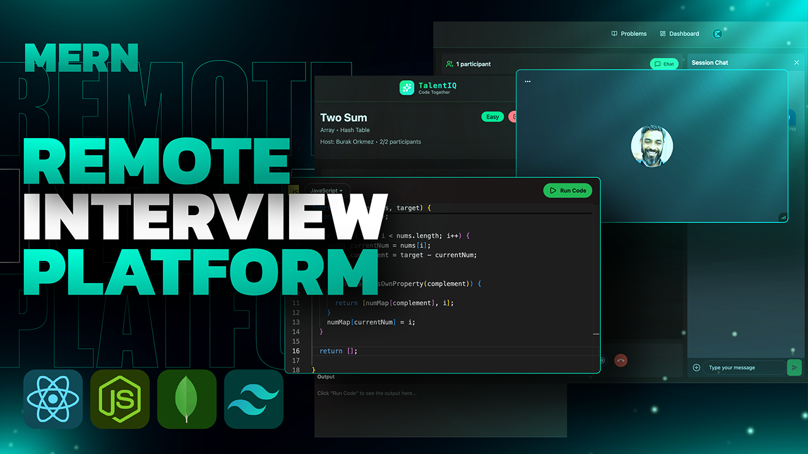

<h1 align="center">
   CodeX: Where Coding Meets Symbiosis
</h1>

<p align="center">
  <strong>An AI-Powered Mock Interview & Real-Time Collaborative Pair Programming Platform</strong>
</p>

<p align="center">
  
  
  
  
  
</p>

---

## 🌟 Overview

**CodeX** is a next-generation platform built to bridge the gap between solo problem solving and collaborative coding. Whether you are preparing for your next technical interview using our **AI Interviewer** or pair-programming with a friend in a **Real-Time Video Session**, CodeX provides a premium, distraction-free environment.



## ✨ Key Features

- 🤖 **AI Mock Interviews:** Practice with an interactive AI agent that gives instant voice feedback, asks follow-up questions, and generates performance reports.
- 👯 **Real-Time Collaboration:** Pair program instantly. Code changes and language selections sync in real-time across users using `Socket.io`.
- 🎥 **HD Video & Audio Calls:** Built-in 1-on-1 video rooms powered by `Stream IO`, complete with screen sharing, mic/cam toggles.
- 🧑‍💻 **VSCode-Powered Editor:** Integrated `Monaco Editor` with syntax highlighting and multi-language support (C++, Python, Java, JavaScript).
- ⚙️ **Secure Code Execution:** Run your code safely in an isolated environment powered by JDoodle/Piston APIs.
- 🔐 **Authentication & Security:** Seamless user management via `Clerk` with strict route protection.
- 👮 **Anti-Cheat Mechanisms:** Enforced full-screen mode during active interviews. Exiting full-screen notifies the interviewer.
- 🎨 **Premium UI/UX:** Fully responsive, modern dark-mode aesthetic utilizing `TailwindCSS` and `DaisyUI`.
- 🧠 **Background Jobs:** Async user-syncing workflows managed robustly by `Inngest`.

---

## 🛠️ Tech Stack

### **Frontend**
- **Framework:** React.js (Vite)
- **Styling:** TailwindCSS, DaisyUI
- **State Management & Fetching:** TanStack Query, Axios
- **Real-time:** Socket.io-client, Stream Video SDK
- **Code Editor:** `@monaco-editor/react`

### **Backend**
- **Server:** Node.js, Express.js
- **Database:** MongoDB (Mongoose)
- **Authentication:** Clerk
- **Real-time:** Socket.io
- **AI Integration:** Google Gemini API / Groq
- **Job Queues:** Inngest

---

## 🚀 Quick Start (Local Development)

### 1. Clone the repository
```bash
git clone https://github.com/YOUR_USERNAME/YOUR_REPO_NAME.git
cd YOUR_REPO_NAME
```

### 2. Setup Environment Variables
You will need two `.env` files. 

**Backend (`/backend/.env`)**
```env
PORT=3000
NODE_ENV=development
DB_URL=your_mongodb_connection_string

# Authentication
CLERK_PUBLISHABLE_KEY=your_clerk_publishable_key
CLERK_SECRET_KEY=your_clerk_secret_key

# Services
STREAM_API_KEY=your_stream_api_key
STREAM_API_SECRET=your_stream_api_secret
GEMINI_API_KEY=your_gemini_key

# Allowed Origins (Frontend URL)
CLIENT_URL=http://localhost:5173
```

**Frontend (`/frontend/.env`)**
```env
VITE_CLERK_PUBLISHABLE_KEY=your_clerk_publishable_key
VITE_STREAM_API_KEY=your_stream_api_key

# Backend API URL
VITE_API_URL=http://localhost:3000/api
```

### 3. Run the Backend
```bash
cd backend
npm install
npm run dev
```

### 4. Run the Frontend
```bash
cd frontend
npm install
npm run dev
```

The application will be accessible at `http://localhost:5173`.

---

## 🌐 Deployment Guidelines

CodeX is fully ready for production deployment on platforms like Vercel (Frontend) and Render (Backend).

1. **Deploy Backend (e.g., Render)**:
   - Root Directory: `backend`
   - Build Command: `npm install`
   - Start Command: `node src/server.js`
   - *Note: Set your `CLIENT_URL` environment variable to your Frontend's live URL.*

2. **Deploy Frontend (e.g., Vercel)**:
   - Root Directory: `frontend`
   - *Note: Set your `VITE_API_URL` environment variable to your Backend's live URL (e.g., `https://api.codex.com/api`).*

---

## 👨‍💻 Developed By
**Built with ❤️ by Students of UCER.** 
*Focusing on building high-impact tools that help students ace their technical careers.*

© 2026 CodeX. All rights reserved.
